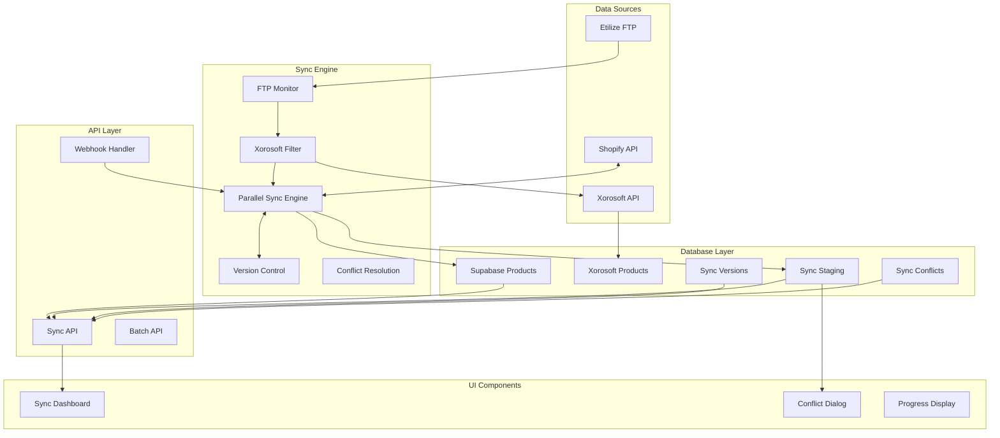

# Enhanced Sync System Technical Design

## Executive Summary

This document outlines the technical design for an enhanced synchronization system that integrates three major components:
1. **Etilize Sync Tool** - FTP monitoring, data extraction, and CSV processing
2. **Shopify Bidirectional Sync** - Two-way synchronization with change tracking and versioning
3. **Xorosoft Integration** - Real-time inventory and product validation

## System Architecture Overview



## Database Schema Design

### 1. Core Tables (Existing)

```sql
-- Existing products table
products (
    id INTEGER PRIMARY KEY,
    sku VARCHAR(100) UNIQUE NOT NULL,
    name VARCHAR(500) NOT NULL,
    shopify_product_id VARCHAR(50),
    shopify_variant_id VARCHAR(50),
    -- ... existing fields ...
)

-- Existing categories table
categories (
    id INTEGER PRIMARY KEY,
    name VARCHAR(255) NOT NULL,
    shopify_collection_id VARCHAR(50),
    -- ... existing fields ...
)
```

### 2. New Tables for Enhanced Sync

```sql
-- Xorosoft products table for inventory sync
CREATE TABLE xorosoft_products (
    id SERIAL PRIMARY KEY,
    base_part VARCHAR(200) UNIQUE NOT NULL,
    handle VARCHAR(255),
    description TEXT,
    stock_level INTEGER DEFAULT 0,
    price DECIMAL(10,2),
    cost_price DECIMAL(10,2),
    weight DECIMAL(10,3),
    manufacturer VARCHAR(200),
    manufacturer_part_number VARCHAR(200),
    upc VARCHAR(20),
    last_updated TIMESTAMP DEFAULT CURRENT_TIMESTAMP,
    api_response JSONB,
    created_at TIMESTAMP DEFAULT CURRENT_TIMESTAMP,
    updated_at TIMESTAMP DEFAULT CURRENT_TIMESTAMP,
    
    INDEX idx_xorosoft_base_part (base_part),
    INDEX idx_xorosoft_handle (handle),
    INDEX idx_xorosoft_updated (last_updated)
);

-- Sync staging table for review before sync
CREATE TABLE sync_staging (
    id SERIAL PRIMARY KEY,
    staging_id UUID DEFAULT gen_random_uuid() UNIQUE NOT NULL,
    product_id INTEGER REFERENCES products(id),
    operation_type VARCHAR(20) NOT NULL, -- create, update, delete
    source VARCHAR(20) NOT NULL, -- etilize, shopify, xorosoft, manual
    
    -- Current vs proposed changes
    current_data JSONB,
    proposed_data JSONB,
    changes JSONB, -- Computed diff between current and proposed
    
    -- Status tracking
    status VARCHAR(20) DEFAULT 'pending', -- pending, approved, rejected, synced, failed
    priority INTEGER DEFAULT 3, -- 1=critical, 2=high, 3=normal, 4=low, 5=batch
    
    -- Review and approval
    reviewed_by INTEGER REFERENCES users(id),
    reviewed_at TIMESTAMP,
    review_notes TEXT,
    auto_approve BOOLEAN DEFAULT FALSE,
    
    -- Sync tracking
    sync_started_at TIMESTAMP,
    sync_completed_at TIMESTAMP,
    sync_result JSONB,
    error_message TEXT,
    retry_count INTEGER DEFAULT 0,
    
    -- Metadata
    created_by INTEGER REFERENCES users(id),
    created_at TIMESTAMP DEFAULT CURRENT_TIMESTAMP,
    updated_at TIMESTAMP DEFAULT CURRENT_TIMESTAMP,
    
    INDEX idx_staging_status (status),
    INDEX idx_staging_product (product_id),
    INDEX idx_staging_created (created_at)
);

-- Product versions for change tracking
CREATE TABLE product_versions (
    id SERIAL PRIMARY KEY,
    product_id INTEGER REFERENCES products(id),
    version_number INTEGER NOT NULL,
    
    -- Snapshot of product data at this version
    product_data JSONB NOT NULL,
    shopify_data JSONB,
    
    -- Change metadata
    changed_fields TEXT[], -- Array of field names that changed
    change_source VARCHAR(50), -- etilize, shopify, manual, api
    change_type VARCHAR(20), -- create, update, delete
    
    -- User tracking
    created_by INTEGER REFERENCES users(id),
    created_at TIMESTAMP DEFAULT CURRENT_TIMESTAMP,
    
    -- Make version numbers unique per product
    UNIQUE(product_id, version_number),
    INDEX idx_version_product (product_id),
    INDEX idx_version_created (created_at)
);

-- Etilize sync tracking
CREATE TABLE etilize_sync_jobs (
    id SERIAL PRIMARY KEY,
    job_id UUID DEFAULT gen_random_uuid() UNIQUE NOT NULL,
    
    -- FTP file tracking
    ftp_filename VARCHAR(255) NOT NULL,
    ftp_file_size BIGINT,
    ftp_modified_date TIMESTAMP,
    download_started_at TIMESTAMP,
    download_completed_at TIMESTAMP,
    
    -- Processing status
    status VARCHAR(20) DEFAULT 'pending', -- pending, downloading, processing, completed, failed
    total_rows INTEGER,
    processed_rows INTEGER DEFAULT 0,
    matched_products INTEGER DEFAULT 0,
    new_products INTEGER DEFAULT 0,
    updated_products INTEGER DEFAULT 0,
    failed_rows INTEGER DEFAULT 0,
    
    -- Xorosoft filtering
    xorosoft_filtered INTEGER DEFAULT 0,
    xorosoft_api_calls INTEGER DEFAULT 0,
    
    -- Results
    csv_output_path VARCHAR(500),
    error_log TEXT,
    processing_notes JSONB,
    
    -- Timing
    started_at TIMESTAMP,
    completed_at TIMESTAMP,
    processing_duration_seconds INTEGER,
    
    created_at TIMESTAMP DEFAULT CURRENT_TIMESTAMP,
    updated_at TIMESTAMP DEFAULT CURRENT_TIMESTAMP,
    
    INDEX idx_etilize_status (status),
    INDEX idx_etilize_created (created_at)
);

-- Sync conflict resolution
CREATE TABLE sync_conflict_resolutions (
    id SERIAL PRIMARY KEY,
    conflict_id INTEGER REFERENCES sync_conflicts(id),
    
    -- Resolution rules
    rule_name VARCHAR(100) NOT NULL,
    rule_type VARCHAR(50), -- field_priority, source_priority, newest_wins, manual
    rule_config JSONB,
    
    -- Application
    applied_at TIMESTAMP,
    applied_by INTEGER REFERENCES users(id),
    result JSONB,
    
    created_at TIMESTAMP DEFAULT CURRENT_TIMESTAMP,
    
    INDEX idx_resolution_conflict (conflict_id)
);
```

### 3. Materialized Views for Performance

```sql
-- Product sync status view
CREATE MATERIALIZED VIEW product_sync_status AS
SELECT 
    p.id,
    p.sku,
    p.name,
    p.shopify_product_id,
    p.updated_at as local_updated,
    sh.last_synced_at as shopify_synced,
    COALESCE(pv.version_number, 0) as latest_version,
    ss.status as staging_status,
    ss.operation_type as pending_operation,
    xp.stock_level as xorosoft_stock,
    xp.last_updated as xorosoft_updated,
    CASE 
        WHEN ss.status = 'pending' THEN 'pending_sync'
        WHEN p.updated_at > sh.last_synced_at THEN 'needs_sync'
        WHEN sh.last_synced_at IS NULL THEN 'never_synced'
        ELSE 'synced'
    END as sync_status
FROM products p
LEFT JOIN sync_history sh ON p.id = sh.product_id 
    AND sh.id = (
        SELECT MAX(id) FROM sync_history WHERE product_id = p.id
    )
LEFT JOIN product_versions pv ON p.id = pv.product_id
    AND pv.version_number = (
        SELECT MAX(version_number) FROM product_versions WHERE product_id = p.id
    )
LEFT JOIN sync_staging ss ON p.id = ss.product_id 
    AND ss.status = 'pending'
LEFT JOIN xorosoft_products xp ON p.sku = xp.base_part
WITH DATA;

-- Create indexes on the materialized view
CREATE INDEX idx_sync_status ON product_sync_status(sync_status);
CREATE INDEX idx_sync_sku ON product_sync_status(sku);

-- Refresh strategy
CREATE OR REPLACE FUNCTION refresh_product_sync_status()
RETURNS void AS $$
BEGIN
    REFRESH MATERIALIZED VIEW CONCURRENTLY product_sync_status;
END;
$$ LANGUAGE plpgsql;
```

## API Endpoint Specifications

### 1. Etilize Sync Endpoints

```python
# POST /api/etilize/sync/start
"""
Start a new Etilize sync job
Request:
{
    "auto_download": true,
    "apply_xorosoft_filter": true,
    "create_staging_entries": true,
    "auto_approve_threshold": 0.95  // Auto-approve if confidence > 95%
}
Response:
{
    "job_id": "uuid",
    "status": "started",
    "estimated_duration": 3600
}
"""

# GET /api/etilize/sync/status/{job_id}
"""
Get status of Etilize sync job
Response:
{
    "job_id": "uuid",
    "status": "processing",
    "progress": {
        "total_rows": 50000,
        "processed_rows": 25000,
        "matched_products": 20000,
        "new_products": 3000,
        "xorosoft_filtered": 2000
    },
    "estimated_completion": "2024-01-15T10:30:00Z"
}
"""

# POST /api/etilize/sync/download
"""
Manually trigger FTP download
Request:
{
    "filename": "CowanOfficeSupplies.zip",
    "extract_immediately": true
}
"""
```

### 2. Shopify Bidirectional Sync Endpoints

```python
# POST /api/shopify/sync/down
"""
Sync products from Shopify to Supabase
Request:
{
    "sync_mode": "incremental",  // full, incremental, selective
    "since_date": "2024-01-01T00:00:00Z",
    "product_ids": [],  // Optional: specific products
    "create_versions": true,
    "detect_conflicts": true
}
Response:
{
    "sync_id": "uuid",
    "products_synced": 150,
    "conflicts_detected": 5,
    "versions_created": 150
}
"""

# POST /api/shopify/sync/up
"""
Sync products from Supabase to Shopify (with staging)
Request:
{
    "product_ids": [1, 2, 3],
    "sync_fields": ["price", "inventory", "description"],
    "require_approval": true,
    "batch_size": 50
}
Response:
{
    "staging_id": "uuid",
    "products_staged": 3,
    "changes_summary": {
        "price_changes": 2,
        "inventory_updates": 3,
        "description_updates": 1
    },
    "approval_required": true
}
"""

# GET /api/shopify/sync/staging/{staging_id}
"""
Get staged changes for review
Response:
{
    "staging_id": "uuid",
    "items": [
        {
            "product_id": 1,
            "sku": "ABC123",
            "changes": {
                "price": {
                    "current": 10.99,
                    "proposed": 12.99,
                    "change_percent": 18.2
                }
            }
        }
    ],
    "total_items": 3,
    "requires_approval": true
}
"""

# POST /api/shopify/sync/staging/{staging_id}/approve
"""
Approve and execute staged sync
Request:
{
    "approved_items": [1, 2, 3],
    "rejected_items": [],
    "approval_notes": "Price updates approved by manager"
}
"""

# GET /api/shopify/sync/conflicts
"""
Get unresolved sync conflicts
Response:
{
    "conflicts": [
        {
            "conflict_id": "uuid",
            "product_sku": "ABC123",
            "field": "price",
            "local_value": 10.99,
            "shopify_value": 12.99,
            "last_local_update": "2024-01-14T10:00:00Z",
            "last_shopify_update": "2024-01-14T11:00:00Z",
            "auto_resolvable": false
        }
    ],
    "total_conflicts": 5
}
"""

# POST /api/shopify/sync/conflicts/{conflict_id}/resolve
"""
Resolve a sync conflict
Request:
{
    "resolution": "use_shopify",  // use_local, use_shopify, custom
    "custom_value": null,
    "apply_to_similar": true
}
"""
```

### 3. Xorosoft Integration Endpoints

```python
# POST /api/xorosoft/sync/inventory
"""
Sync inventory levels from Xorosoft
Request:
{
    "sync_mode": "all",  // all, changed, specific
    "product_skus": [],
    "update_shopify": true,
    "batch_size": 100
}
Response:
{
    "sync_id": "uuid",
    "products_checked": 1000,
    "inventory_updates": 150,
    "out_of_stock_alerts": 25
}
"""

# GET /api/xorosoft/products/{sku}
"""
Get real-time product info from Xorosoft
Response:
{
    "base_part": "ABC123",
    "stock_level": 50,
    "price": 12.99,
    "cost_price": 8.50,
    "manufacturer": "3M",
    "last_updated": "2024-01-15T09:00:00Z"
}
"""

# POST /api/xorosoft/validate
"""
Validate products against Xorosoft catalog
Request:
{
    "product_skus": ["ABC123", "DEF456"],
    "validation_mode": "strict"  // strict, fuzzy
}
Response:
{
    "validated": 2,
    "results": {
        "ABC123": {
            "valid": true,
            "match_type": "exact",
            "xorosoft_data": {...}
        }
    }
}
"""
```

### 4. Batch Operations API

```python
# POST /api/batch/sync/create
"""
Create a batch sync operation
Request:
{
    "name": "Daily Price Update",
    "operations": [
        {
            "type": "sync_down",
            "config": {...}
        },
        {
            "type": "xorosoft_inventory",
            "config": {...}
        },
        {
            "type": "sync_up",
            "config": {...}
        }
    ],
    "schedule": "0 2 * * *",  // Cron expression
    "notifications": {
        "on_complete": true,
        "on_error": true,
        "webhook_url": "https://..."
    }
}
"""
```

## Data Flow Workflows

### 1. Etilize Import Workflow

```python
def etilize_import_workflow():
    """
    Complete Etilize import workflow with Xorosoft filtering
    """
    # Step 1: Monitor FTP for new files
    new_file = ftp_monitor.check_for_new_files()
    if not new_file:
        return
    
    # Step 2: Download and extract
    job = EtilizeSyncJob.create(filename=new_file)
    extracted_csv = ftp_downloader.download_and_extract(new_file)
    
    # Step 3: Process CSV with Xorosoft filtering
    processor = EtilizeProcessor(job)
    for batch in processor.read_batches(extracted_csv):
        # Validate against Xorosoft
        validated_products = xorosoft_api.validate_batch(batch)
        
        # Match with existing products
        matched, new = product_matcher.match_products(validated_products)
        
        # Create staging entries
        staging_entries = []
        for product in matched:
            changes = calculate_changes(product)
            if changes:
                staging_entries.append(
                    create_staging_entry(product, changes, 'update')
                )
        
        for product in new:
            staging_entries.append(
                create_staging_entry(product, None, 'create')
            )
        
        # Bulk insert staging entries
        SyncStaging.bulk_create(staging_entries)
    
    # Step 4: Auto-approve high confidence matches
    auto_approve_staging_entries(job.staging_entries)
    
    return job
```

### 2. Shopify Sync Down Workflow

```python
def shopify_sync_down_workflow(since_date=None):
    """
    Sync products from Shopify to Supabase with versioning
    """
    # Step 1: Fetch products from Shopify
    shopify_products = shopify_api.get_products(
        updated_at_min=since_date,
        fields=['id', 'title', 'variants', 'images', 'metafields']
    )
    
    # Step 2: Process in parallel batches
    with ParallelSyncEngine() as engine:
        for batch in chunk_products(shopify_products, size=50):
            engine.add_operation(
                SyncOperation(
                    operation_type=OperationType.SYNC_DOWN,
                    product_ids=[p.id for p in batch],
                    data={'products': batch}
                )
            )
        
        results = engine.execute()
    
    # Step 3: Detect conflicts and create versions
    for result in results:
        for product in result.products:
            local_product = Product.get(shopify_product_id=product.id)
            
            if local_product:
                # Check for conflicts
                conflicts = detect_conflicts(local_product, product)
                if conflicts:
                    create_sync_conflicts(conflicts)
                
                # Create version
                create_product_version(local_product, product)
                
                # Update local product
                update_local_product(local_product, product)
            else:
                # Create new product
                create_local_product(product)
    
    return results
```

### 3. Staged Sync Up Workflow

```python
def staged_sync_up_workflow(product_ids, sync_fields):
    """
    Stage changes for sync from Supabase to Shopify
    """
    # Step 1: Gather products and calculate changes
    products = Product.query.filter(Product.id.in_(product_ids)).all()
    staging_entries = []
    
    for product in products:
        shopify_product = get_shopify_product(product.shopify_product_id)
        changes = calculate_sync_changes(product, shopify_product, sync_fields)
        
        if changes:
            entry = SyncStaging(
                product_id=product.id,
                operation_type='update',
                source='manual',
                current_data=shopify_product.to_dict(),
                proposed_data=merge_changes(shopify_product, changes),
                changes=changes,
                auto_approve=False  # Require manual approval
            )
            staging_entries.append(entry)
    
    # Step 2: Bulk create staging entries
    db.session.bulk_save_objects(staging_entries)
    db.session.commit()
    
    # Step 3: Return staging summary
    return {
        'staging_id': staging_entries[0].staging_id,
        'total_products': len(staging_entries),
        'changes_summary': summarize_changes(staging_entries)
    }

def execute_staged_sync(staging_id, approved_items):
    """
    Execute approved staged changes
    """
    # Get approved staging entries
    entries = SyncStaging.query.filter(
        SyncStaging.staging_id == staging_id,
        SyncStaging.id.in_(approved_items),
        SyncStaging.status == 'pending'
    ).all()
    
    # Execute in parallel
    with ParallelSyncEngine() as engine:
        for entry in entries:
            engine.add_operation(
                SyncOperation(
                    operation_type=OperationType.UPDATE,
                    product_ids=[entry.product_id],
                    data=entry.proposed_data,
                    priority=SyncPriority.HIGH
                )
            )
        
        results = engine.execute()
    
    # Update staging entries
    for entry, result in zip(entries, results):
        if result.success:
            entry.status = 'synced'
            entry.sync_completed_at = datetime.utcnow()
            entry.sync_result = result.data
        else:
            entry.status = 'failed'
            entry.error_message = result.error
    
    db.session.commit()
    return results
```

## Frontend Components Design

### 1. Sync Dashboard Component

```typescript
interface SyncDashboardProps {
    activeJobs: SyncJob[];
    syncMetrics: SyncMetrics;
    onRefresh: () => void;
}

const SyncDashboard: React.FC<SyncDashboardProps> = ({ activeJobs, syncMetrics, onRefresh }) => {
    return (
        <div className="sync-dashboard">
            {/* Real-time metrics */}
            <MetricsPanel metrics={syncMetrics} />
            
            {/* Active sync jobs */}
            <ActiveJobsList jobs={activeJobs} />
            
            {/* Sync history chart */}
            <SyncHistoryChart />
            
            {/* Quick actions */}
            <QuickActions>
                <Button onClick={startEtilizeSync}>Start Etilize Sync</Button>
                <Button onClick={syncFromShopify}>Sync from Shopify</Button>
                <Button onClick={viewStagedChanges}>View Staged Changes</Button>
            </QuickActions>
        </div>
    );
};
```

### 2. Staged Changes Review Component

```typescript
interface StagedChangesProps {
    stagingId: string;
    items: StagedItem[];
    onApprove: (items: number[]) => void;
    onReject: (items: number[]) => void;
}

const StagedChangesReview: React.FC<StagedChangesProps> = ({ stagingId, items, onApprove, onReject }) => {
    const [selectedItems, setSelectedItems] = useState<number[]>([]);
    const [viewMode, setViewMode] = useState<'grid' | 'diff'>('grid');
    
    return (
        <div className="staged-changes-review">
            {/* Header with actions */}
            <div className="review-header">
                <h2>Review Staged Changes ({items.length} items)</h2>
                <div className="actions">
                    <Button variant="success" onClick={() => onApprove(selectedItems)}>
                        Approve Selected ({selectedItems.length})
                    </Button>
                    <Button variant="danger" onClick={() => onReject(selectedItems)}>
                        Reject Selected
                    </Button>
                </div>
            </div>
            
            {/* View mode toggle */}
            <ViewModeToggle mode={viewMode} onChange={setViewMode} />
            
            {/* Changes list/grid */}
            {viewMode === 'grid' ? (
                <ChangesGrid items={items} onSelect={setSelectedItems} />
            ) : (
                <ChangesDiffView items={items} onSelect={setSelectedItems} />
            )}
        </div>
    );
};
```

### 3. Conflict Resolution Dialog

```typescript
interface ConflictDialogProps {
    conflict: SyncConflict;
    onResolve: (resolution: ConflictResolution) => void;
    onCancel: () => void;
}

const ConflictResolutionDialog: React.FC<ConflictDialogProps> = ({ conflict, onResolve, onCancel }) => {
    const [resolution, setResolution] = useState<'local' | 'shopify' | 'custom'>('local');
    const [customValue, setCustomValue] = useState(conflict.local_value);
    
    return (
        <Dialog open={true} onClose={onCancel}>
            <DialogTitle>Resolve Sync Conflict</DialogTitle>
            <DialogContent>
                <div className="conflict-info">
                    <p>Product: {conflict.product_name} (SKU: {conflict.product_sku})</p>
                    <p>Field: {conflict.field_name}</p>
                </div>
                
                <div className="conflict-values">
                    <div className="value-option">
                        <Radio
                            checked={resolution === 'local'}
                            onChange={() => setResolution('local')}
                        />
                        <label>
                            <strong>Local Value:</strong> {conflict.local_value}
                            <span className="timestamp">Updated: {conflict.local_updated}</span>
                        </label>
                    </div>
                    
                    <div className="value-option">
                        <Radio
                            checked={resolution === 'shopify'}
                            onChange={() => setResolution('shopify')}
                        />
                        <label>
                            <strong>Shopify Value:</strong> {conflict.shopify_value}
                            <span className="timestamp">Updated: {conflict.shopify_updated}</span>
                        </label>
                    </div>
                    
                    <div className="value-option">
                        <Radio
                            checked={resolution === 'custom'}
                            onChange={() => setResolution('custom')}
                        />
                        <label>
                            <strong>Custom Value:</strong>
                            <Input
                                value={customValue}
                                onChange={(e) => setCustomValue(e.target.value)}
                                disabled={resolution !== 'custom'}
                            />
                        </label>
                    </div>
                </div>
            </DialogContent>
            <DialogActions>
                <Button onClick={onCancel}>Cancel</Button>
                <Button
                    variant="primary"
                    onClick={() => onResolve({
                        resolution_type: resolution,
                        value: resolution === 'custom' ? customValue : undefined
                    })}
                >
                    Resolve Conflict
                </Button>
            </DialogActions>
        </Dialog>
    );
};
```

## Performance Optimizations

### 1. Parallel Processing Architecture

```python
class EnhancedParallelSyncEngine:
    """
    Enhanced sync engine with intelligent batching and caching
    """
    def __init__(self):
        self.worker_pool = DynamicWorkerPool(min_workers=4, max_workers=16)
        self.operation_queue = PriorityQueue()
        self.batch_processor = BatchProcessor()
        self.cache = SyncCache()
        
    def optimize_operations(self, operations):
        """
        Optimize operations for parallel execution
        """
        # Group by operation type
        grouped = defaultdict(list)
        for op in operations:
            grouped[op.operation_type].append(op)
        
        # Batch similar operations
        batched_operations = []
        for op_type, ops in grouped.items():
            if len(ops) > 10:
                # Create batch operations
                for batch in chunk(ops, 50):
                    batched_operations.append(
                        BatchOperation(op_type, batch)
                    )
            else:
                batched_operations.extend(ops)
        
        return batched_operations
```

### 2. Caching Strategy

```python
class SyncCache:
    """
    Multi-level caching for sync operations
    """
    def __init__(self):
        self.memory_cache = TTLCache(maxsize=10000, ttl=300)  # 5 min TTL
        self.redis_cache = RedisCache()
        self.db_cache = DatabaseCache()
        
    async def get_product_data(self, product_id):
        # L1: Memory cache
        if product_id in self.memory_cache:
            return self.memory_cache[product_id]
        
        # L2: Redis cache
        data = await self.redis_cache.get(f"product:{product_id}")
        if data:
            self.memory_cache[product_id] = data
            return data
        
        # L3: Database
        product = await Product.get(product_id)
        if product:
            await self.cache_product(product)
            return product
        
        return None
```

### 3. Database Query Optimization

```sql
-- Optimized query for sync status
CREATE INDEX idx_sync_composite ON products(shopify_product_id, updated_at);
CREATE INDEX idx_staging_composite ON sync_staging(product_id, status, created_at);

-- Batch update optimization
CREATE OR REPLACE FUNCTION batch_update_sync_status(
    product_ids INTEGER[],
    new_status VARCHAR
) RETURNS void AS $$
BEGIN
    UPDATE sync_staging
    SET status = new_status,
        updated_at = CURRENT_TIMESTAMP
    WHERE product_id = ANY(product_ids)
    AND status = 'pending';
END;
$$ LANGUAGE plpgsql;
```

## Security Considerations

### 1. API Authentication

```python
# JWT token validation for sync operations
@app.before_request
def validate_sync_permissions():
    if request.path.startswith('/api/sync'):
        user = get_current_user()
        if not user.has_permission('sync.execute'):
            abort(403, 'Insufficient permissions for sync operations')
```

### 2. Data Validation

```python
class SyncDataValidator:
    """
    Validate sync data before processing
    """
    def validate_product_data(self, data):
        # Sanitize HTML content
        if 'description' in data:
            data['description'] = sanitize_html(data['description'])
        
        # Validate numeric fields
        if 'price' in data:
            if not isinstance(data['price'], (int, float)) or data['price'] < 0:
                raise ValidationError('Invalid price value')
        
        # Validate SKU format
        if 'sku' in data:
            if not re.match(r'^[A-Z0-9\-]+$', data['sku']):
                raise ValidationError('Invalid SKU format')
        
        return data
```

## Monitoring and Alerting

### 1. Sync Metrics Collection

```python
class SyncMetricsCollector:
    """
    Collect and aggregate sync metrics
    """
    def __init__(self):
        self.metrics = {
            'sync_operations_total': Counter('sync_operations_total'),
            'sync_duration_seconds': Histogram('sync_duration_seconds'),
            'sync_errors_total': Counter('sync_errors_total'),
            'api_calls_total': Counter('api_calls_total'),
            'conflict_detections_total': Counter('conflict_detections_total')
        }
    
    def record_sync_operation(self, operation_type, duration, success):
        self.metrics['sync_operations_total'].inc()
        self.metrics['sync_duration_seconds'].observe(duration)
        if not success:
            self.metrics['sync_errors_total'].inc()
```

### 2. Alert Configuration

```yaml
# alerts.yaml
alerts:
  - name: sync_error_rate_high
    condition: rate(sync_errors_total[5m]) > 0.1
    severity: warning
    notification:
      - email: admin@example.com
      - slack: #sync-alerts
  
  - name: sync_queue_backup
    condition: sync_queue_depth > 1000
    severity: critical
    notification:
      - pagerduty: sync-team
```

## Implementation Phases

### Phase 1: Foundation (Weeks 1-2)
- Set up database schema migrations
- Implement basic sync staging table
- Create product versioning system
- Build conflict detection logic

### Phase 2: Etilize Integration (Weeks 3-4)
- Implement FTP monitoring service
- Build Xorosoft API integration
- Create CSV processing pipeline
- Implement metafield combination logic

### Phase 3: Shopify Bidirectional Sync (Weeks 5-6)
- Build sync down functionality
- Implement staging and approval workflow
- Create conflict resolution system
- Add version comparison tools

### Phase 4: UI Components (Weeks 7-8)
- Build sync dashboard
- Create staging review interface
- Implement conflict resolution dialogs
- Add progress tracking displays

### Phase 5: Testing and Optimization (Weeks 9-10)
- Performance testing and optimization
- Security audit and hardening
- Documentation completion
- Production deployment

## Success Metrics

1. **Performance Metrics**
   - Sync operations per second: > 100
   - Average sync latency: < 2 seconds
   - Conflict detection accuracy: > 95%
   - API call efficiency: < 1.5 calls per product

2. **Reliability Metrics**
   - Sync success rate: > 99.5%
   - Data consistency: 100%
   - Conflict resolution rate: > 90% automated
   - System uptime: > 99.9%

3. **Business Metrics**
   - Time to sync catalog: < 1 hour for 50k products
   - Manual intervention required: < 5% of syncs
   - Data freshness: < 5 minutes lag
   - User satisfaction: > 90%

## Conclusion

This enhanced sync system design provides a robust, scalable solution for managing product data across multiple systems. The architecture supports high-performance parallel processing, intelligent conflict resolution, and comprehensive change tracking while maintaining data integrity and providing excellent user experience.

The modular design allows for incremental implementation and future extensibility, while the monitoring and alerting systems ensure reliable operation in production environments.