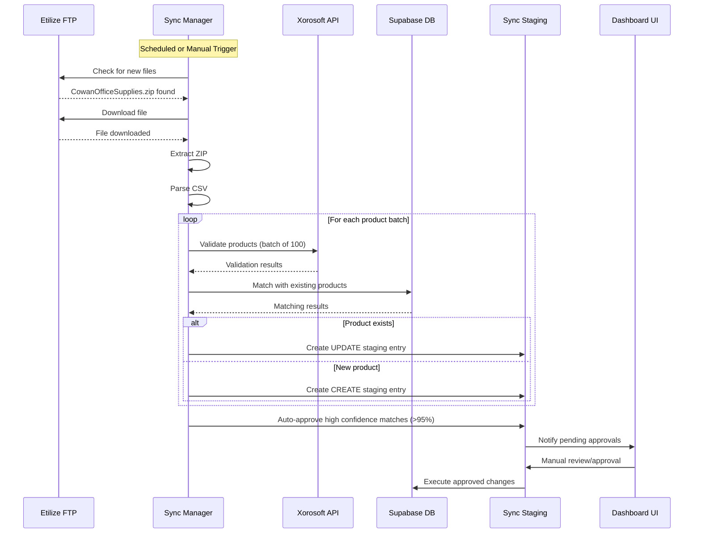
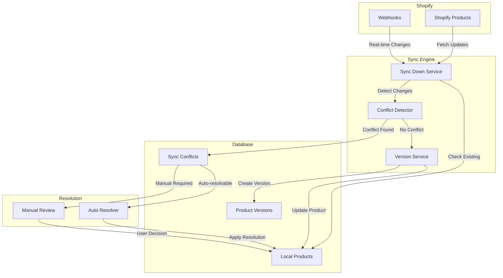
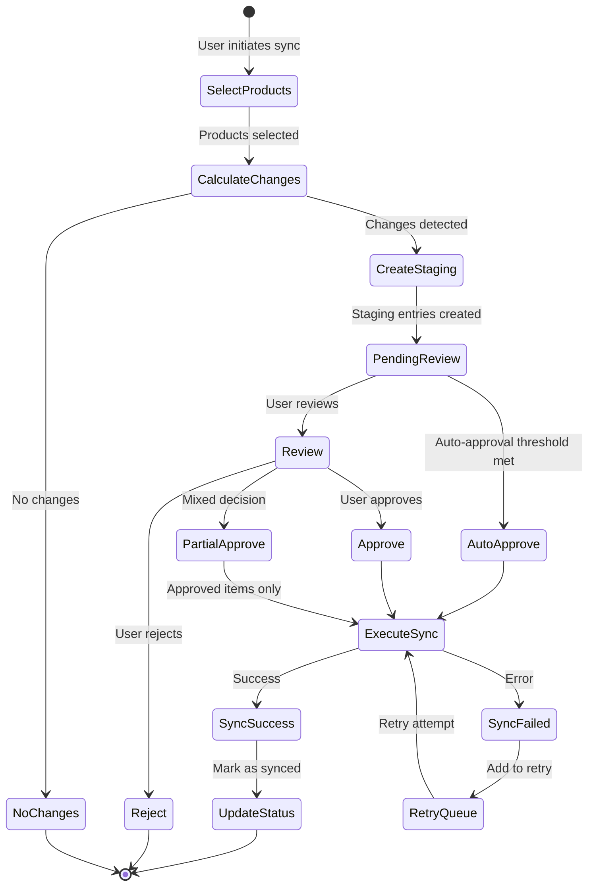
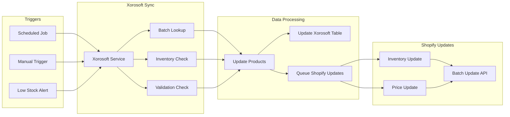
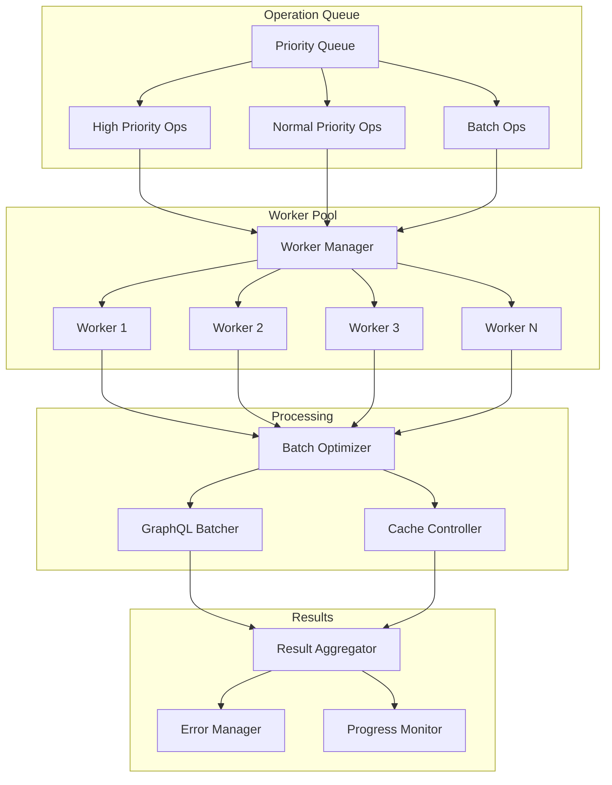
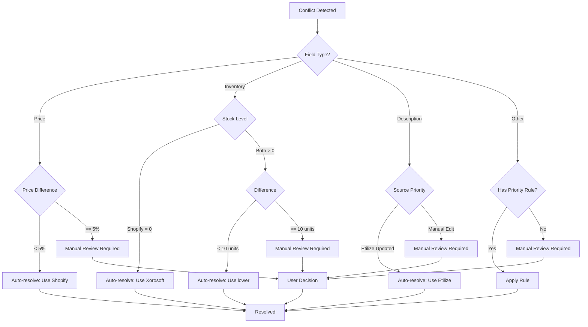
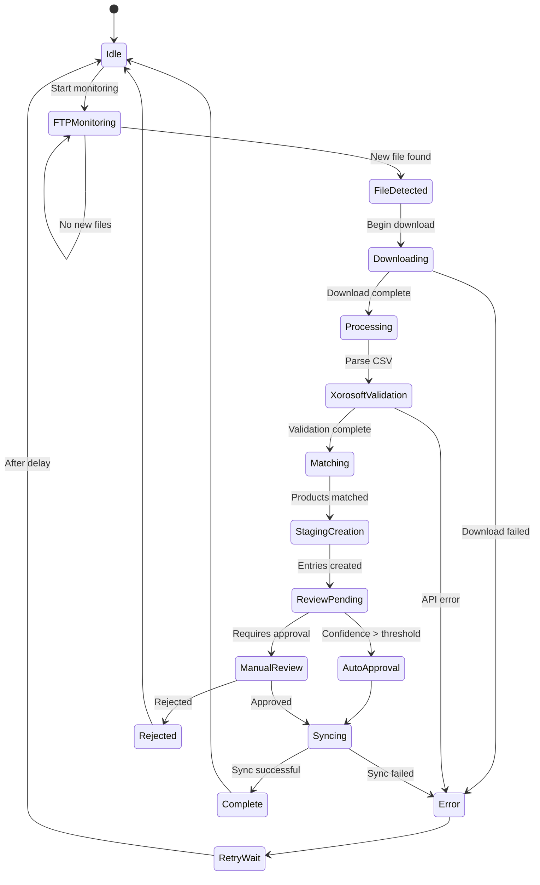
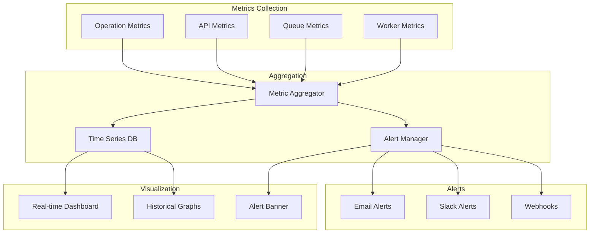
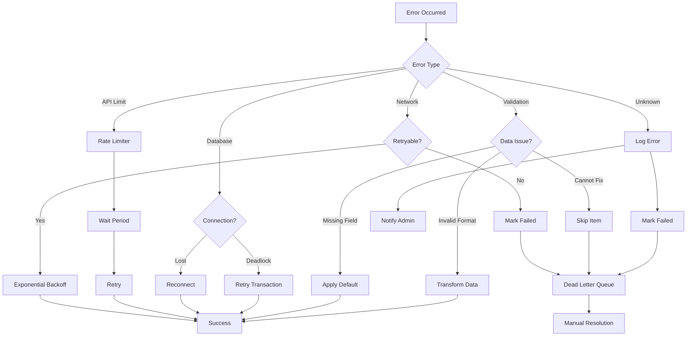
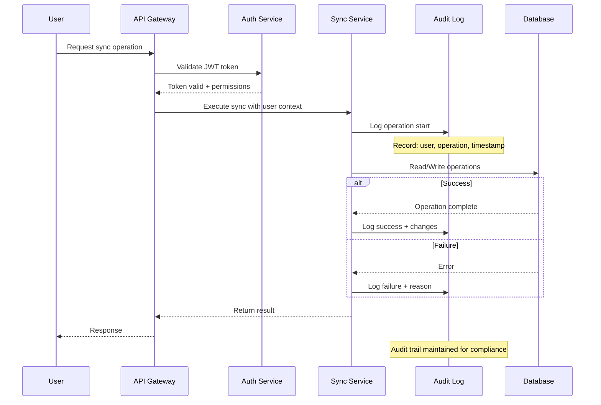

# Sync System Flow Diagrams

## 1. Etilize Sync Workflow

## 2. Shopify Bidirectional Sync Flow

### 2.1 Sync Down (Shopify → Supabase)

### 2.2 Staged Sync Up (Supabase → Shopify)

## 3. Xorosoft Integration Flow

## 4. Parallel Processing Architecture

## 5. Conflict Resolution Decision Tree

## 6. Data Flow State Machine

## 7. Performance Monitoring Dashboard

## 8. Error Handling and Recovery

## 9. Security and Audit Flow

## Implementation Priority

Based on the analysis of existing code and system requirements, here's the recommended implementation order:

1. **Phase 1: Foundation (Priority: Critical)**
   - Database schema migrations (new tables)
   - Basic staging and versioning models
   - Conflict detection logic

2. **Phase 2: Etilize Integration (Priority: High)**
   - Enhance existing FTP downloader
   - Integrate Xorosoft filtering
   - Implement staging workflow

3. **Phase 3: Shopify Sync (Priority: High)**
   - Sync down with versioning
   - Staged sync up workflow
   - Conflict resolution system

4. **Phase 4: UI Components (Priority: Medium)**
   - Sync dashboard
   - Staging review interface
   - Conflict resolution dialogs

5. **Phase 5: Optimization (Priority: Low)**
   - Performance tuning
   - Advanced caching
   - Monitoring dashboards

Each phase builds upon the previous one, allowing for incremental deployment and testing.