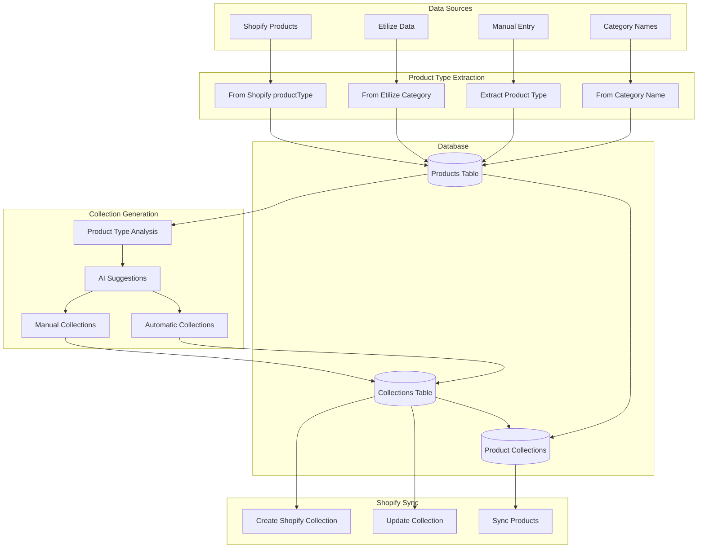

# Product Type to Collection Generation - Data Flow Architecture

## 🎯 Mission Complete: Data Flow Analysis

### 📊 Current State Analysis

#### 1. **Database Schema**

```sql
-- Products Table (models.py)
products:
  - id: Integer (PK)
  - sku: String
  - name: String
  - product_type: String(255) [MISSING IN MODEL BUT ADDED VIA MIGRATION]
  - category_id: Integer (FK)
  - shopify_product_id: String
  - status: String
  - ... other fields

-- Collections Table (models.py)
collections:
  - id: Integer (PK)
  - name: String
  - handle: String (unique)
  - rules_type: String ['manual', 'automatic']
  - rules_conditions: JSON
  - disjunctive: Boolean (OR vs AND)
  - shopify_collection_id: String
  - status: String ['draft', 'active', 'archived']

-- Product-Collection Association
product_collections:
  - id: Integer (PK)
  - product_id: Integer (FK)
  - collection_id: Integer (FK)
  - position: Integer
```

#### 2. **Critical Issue Found**
The `product_type` field is referenced throughout the codebase but is NOT defined in the Product model (models.py). It's only added via migration, creating a mismatch between the ORM model and database schema.

### 🔄 Data Flow Architecture



### 📋 Detailed Flow Steps

#### 1. **Product Type Extraction**
```python
# From shopify_sync_service.py (line 806-824)
product_type = ""
if product.category_name:
    product_type = product.category_name
elif product.etilize_data:
    product_type = product.etilize_data.get('category', '')

# Sent to Shopify as:
'productType': product_type
```

#### 2. **Product Type Summary Generation**
```python
# From collection_repository.py (line 288-311)
def get_product_types_summary():
    # Groups products by product_type
    # Returns count, avg price, brands, categories
    results = query(
        Product.product_type,
        count(Product.id),
        avg(Product.price),
        array_agg(Product.brand),
        array_agg(Product.category_id)
    ).group_by(Product.product_type)
```

#### 3. **Collection Creation Flow**
```python
# Manual Collection Creation
POST /api/collections/create
{
    "name": "Premium Pens",
    "handle": "premium-pens",
    "rules_type": "manual",
    "product_ids": [1, 2, 3]
}

# Automatic Collection Creation
POST /api/collections/create
{
    "name": "All Pens",
    "handle": "all-pens", 
    "rules_type": "automatic",
    "rules_conditions": [{
        "field": "product_type",
        "operator": "contains",
        "value": "Pen"
    }]
}
```

#### 4. **Automatic Collection Population**
```python
# From collection_repository.py (line 200-251)
def get_products_by_rules(rules_conditions):
    # Builds dynamic query based on rules
    if field == 'product_type':
        if operator == 'equals':
            Product.product_type == value
        elif operator == 'contains':
            Product.product_type.contains(value)
```

### 🛠️ Required Fixes

#### 1. **Add product_type to Product Model**
```python
# In models.py, add to Product class:
product_type = Column(String(255), index=True)
```

#### 2. **Product Type Extraction Enhancement**
```python
def extract_product_type(product):
    """Enhanced product type extraction with fallback hierarchy"""
    # Priority order:
    # 1. Explicit product_type field
    # 2. Category name
    # 3. Etilize category
    # 4. Parse from product name
    # 5. Default to 'Uncategorized'
    
    if product.product_type:
        return product.product_type
    
    if product.category and product.category.name:
        return product.category.name
    
    if product.etilize_data:
        return product.etilize_data.get('category', '')
    
    # Smart extraction from name
    return extract_type_from_name(product.name)
```

#### 3. **Bulk Collection Generation**
```python
def generate_collections_from_types():
    """Generate collections for all product types"""
    product_types = get_product_types_summary()
    
    for pt in product_types:
        if pt['product_count'] >= 5:  # Minimum products
            create_automatic_collection(
                name=format_collection_name(pt['name']),
                rules=[{
                    'field': 'product_type',
                    'operator': 'equals',
                    'value': pt['name']
                }]
            )
```

### 🚀 Optimized Workflow

#### Phase 1: Data Preparation
1. Run migration to add product_type field ✓
2. Update Product model to include product_type
3. Backfill product_type for existing products

#### Phase 2: Collection Generation
1. Extract unique product types
2. Generate AI suggestions for collection names/descriptions
3. Create automatic collections with rules
4. Review and adjust manually

#### Phase 3: Shopify Sync
1. Create collections in Shopify
2. Apply collection rules
3. Sync product associations
4. Monitor sync status

### 📊 API Endpoints

```yaml
Collections API:
  - GET /api/collections/product-types-summary
  - POST /api/collections/ai-suggestions
  - POST /api/collections/create
  - POST /api/collections/{id}/products
  - POST /api/collections/{id}/sync-to-shopify
  - GET /api/collections/managed
```

### 🔄 Bulk Operations Flow

```python
# 1. Get all product types
product_types = GET /api/collections/product-types-summary

# 2. Generate AI suggestions
suggestions = POST /api/collections/ai-suggestions
{
    "product_types": ["Pens", "Paper", "Folders"]
}

# 3. Bulk create collections
for suggestion in suggestions:
    POST /api/collections/create
    {
        "name": suggestion.collection_name,
        "handle": suggestion.handle,
        "description": suggestion.description,
        "rules_type": "automatic",
        "rules_conditions": [{
            "field": "product_type",
            "operator": "equals",
            "value": suggestion.product_type
        }]
    }

# 4. Sync all to Shopify
for collection in collections:
    POST /api/collections/{collection.id}/sync-to-shopify
```

### 🎯 Next Steps

1. **Fix Product Model**: Add product_type field to models.py
2. **Data Migration**: Backfill product_type from categories/etilize data
3. **UI Implementation**: Build bulk collection creation interface
4. **Automation**: Set up automatic collection generation for new product types
5. **Monitoring**: Track collection performance and optimize rules

### 💡 Performance Considerations

- Index on product_type field for fast queries
- Batch collection creation to avoid API limits
- Use background jobs for large sync operations
- Cache product type summaries for UI performance
- Implement incremental sync for collection updates